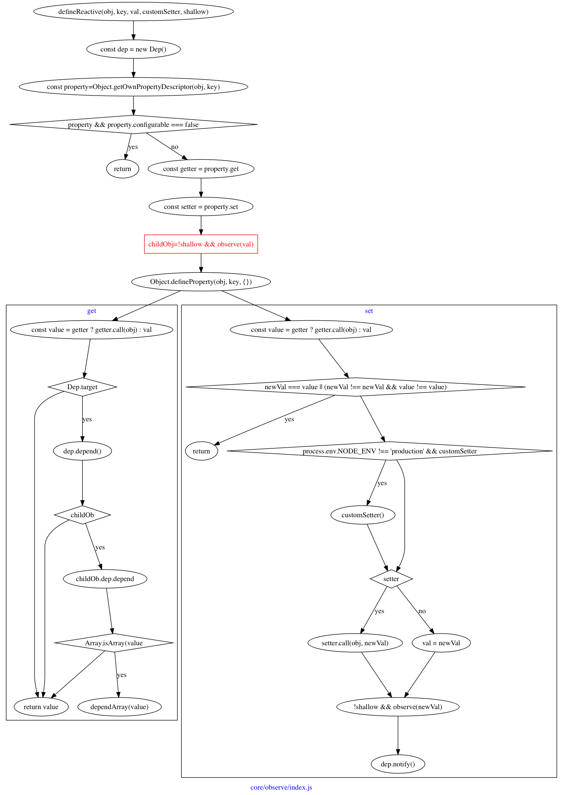

# vue 源码阅读过程

## 起点

```javascript
new Vue({
	el: '#app',
	template: '<App />',
	components: { App },
});
```

从这里开始，发生了什么？


## _init

在`_init`方法中，主要就是给`vm`添加了一些属性

- vm._uid = uid++
- vm._isVue = true
- vm._renderProxy = vm
- vm.$options = options
- vm._self = vm


可以看到，最后面是进行了一系列的初始化函数调用，并且调用了两个生命周期钩子，`beforeCreate`和`created`，这又代表什么含义呢？

### initLifecycle

从名字看是初始化生命周期，实际上也是给`vm`实例添加了很多属性。

- vm.$parent = options.parent
- vm.$root = $parent.root || vm
- vm.$children = []
- vm.$refs = {}
- vm._watcher = null
- vm._inactive = null
- vm._directInactive = false
- vm._isMounted = false = false
- vm._isDestroyed = false
- vm._isBeingDestroyed = false

总的来说，就是`$parent`比较麻烦些，大部分情况应该都是`undefined`吧，不然`vm.$options.parent`是什么时候挂载的？

有点出乎意料的是，在这个函数入口打断点，看到的`vm.$options`不只初始化时传入的属性，还有一些框架添加的，但是在什么时候添加的不清楚。[1]


### initEvent

从名字就看得出来，在这个函数内会对事件进行初始化，但是，是对什么事件进行初始化？

可以看到是从`$options._parentListeners`上取到所谓的`listeners`，如果存在，就更新到组件上。

但是默认情况是没有的，要怎么添加，才可以在这里得到呢？[2]


### initRender

然后到了这里，从名字来看是初始化`render`？

- vm._vnode = null
- vm.$solts = resolveSlots()
- vm.$scopedSlots = emptyObject
- vm._c = func
- vm.$createElement = func
- vm.$attrs
- vm.$listeners


在最后，调用`defineReactive`方法，这个方法接收`obj`、`key`和`val`，即一个对象及指定键值对，然后对值注册监听器。



那是对我们传入的`data`做监听，实现数据响应吗，不是，从`initRender`这张图片最后可以看到，是对`$attrs`和`$listeners`这两个`vm`上的属性做了这个处理。

所以这里就要深究`Dep`到底是什么，怎么工作的[3]

### Dep

注释是：
> A dep is an observable that can have multiple directives subscribing to it.


每个`Dep`实例有`subs`属性，保存了多个`Watcher`实例，在调用`dep.notify`方法时，会遍历该数组，对每个`Watcher`实例调用`update`方法。


### initInjections

[provide/inject](https://cn.vuejs.org/v2/api/#provide-inject)

> provide 和 inject 主要为高阶插件/组件库提供用例。并不推荐直接用于应用程序代码中。


### initState

终于到了我们最熟悉的地方，在`initState`函数内，会对`props`、`methods`、`data`、`computed`以及`watch`进行处理，对，就是我们在日常中最常用到的这些，都在`initState`函数内进行处理。


可以看到，先判断属性是否存在，然后依次调用

- initProps
- initMethods
- initData
- initComputed
- initWatch

下面再对每一个函数深入了解

#### initProps

遍历传入的`props`，首先是进行验证，然后调用`defineReactive`对每个`key`做处理。

- vm._props = {}
- vm.$options._propKeys = []


#### initMethods
很简单的一个函数，其实就是遍历`methods`执行一句代码：

```javascript
vm[key] = methods[key] == null ? noop : bind(methods[key], vm)
```

这里是用的`==`而非`===`，只有在值为真时，才调用`bind`方法，这个方法就是`Function.prototype.bind`的那个，绑定上下文。


#### initData

其实在`initData`内并没有做什么，主要还是一些重复属性的错误提示，最主要的工作还是由`observe`来做的，后面再对这个进行分析。


#### initComputed

首先是初始化了`_computedWatchers`这个属性，从名字来看是保存计算属性的监听器。然后这里存在`isSSR`这个变量用以判断是否为服务端渲染。

然后会实例化多个`watcher`

```javascript
const computedWatcherOptions = { lazy: true };
watchers[key] = new Watcher(
	vm,
	getter || noop,
	noop,
	computedWatcherOptions
)
```


然后对每个`key`调用`defineComputed`函数，其实就是给`sharedPropertyDefinition`设置`get`和`set`属性，最后调用`Object.defineProperty()`。

```javascript
const sharedPropertyDefinition = {
  enumerable: true,
  configurable: true,
  get: noop,
  set: noop
}
```


##### 实例

其实`computed`一直对我来说是很神奇的存在，比如这样的代码：

```javascript
new Vue({
	el: '#app',
	template: '<div><input v-model="name" />{{message}}</div>',
	data() {
		return {
			name: 'ltaoo',
			nickname: 'something',
		};
	},
	computed: {
		message() {
			return 'Hello ' + this.name; 
		},
	},
})
```

当改变输入框内的值时，对应的`message`也会改变。

我好奇的是，为什么知道`name`变化的时候要调用`message`获取新的值？

从上面的源码来看，显示实例化了一个`watcher`保存到`vm._computedWatchers`上，而`Watcher`构造函数内，将`this`存放到`vm.watchers`里面。

然后断点会到`defineComputed`里面，然后再到`createComputedGetter('message')`这个函数，这个函数返回了一个函数`computedGetter`。

```javascript
function createComputedGetter (key) {
  return function computedGetter () {
    const watcher = this._computedWatchers && this._computedWatchers[key]
    if (watcher) {
      if (watcher.dirty) {
        watcher.evaluate()
      }
      if (Dep.target) {
        watcher.depend()
      }
      return watcher.value
    }
  }
}
```

所以`message`这个`key`的`getter`实际上就是`computedGetter`这个函数了，在获取`message`的时候，就会调用它。（初始化时调用`render`也会触发这个函数的调用，以获取`message`值显示在页面上。）

额，我们知道，在`initComputed`内实例化的`watcher`存放在了`vm._computedWatchers`上，`computedGetter`函数内`取出了这个`watcher`，判断是否`dirty`

`dirty === true`所以会调用`evaluate()`，然后会调用`message`拿到值，但此时这个值就已经是`ltaoo1`了！

或者再看看这个组件吧：

```
(function() {
    with (this) {
        return _c('div', [
            _c('input', {
                directives: [
                    {
                        name: 'model',
                        rawName: 'v-model',
                        value: name,
                        expression: 'name',
                    },
                ],
                domProps: { value: name },
                on: {
                    input: function($event) {
                        if ($event.target.composing) return;
                        name = $event.target.value;
                    },
                },
            }),
            _v(_s(message)),
        ]);
    }
});
```
`with`用以延长作用域链，所以`_c`实际上是`this._c`，其他同理。
`_s === toString`，`_v === createTextVNode`，都和`message`没关系，还是不知道为什么`message`会改变。

其实是`name`改变后，会调用`render`重新计算`vnode`，导致的`message`改变？

但是虽然断点会到`computedGetter`这里，表示的确有去取`message`这个变量，但是在去的过程中，`watcher.dirty === false`，所以不调用`message`这个函数，导致`message`值并没有发生改变。

但为什么`watcher.dirty === false`而之前会是`true`呢？

因为调用了`update`，为什么`watcher`上的`update`会被调用呢？

因为`name`值发生了改变，调用了对应的`setter`，在`setter`内会调用`dep.notify`，该方法会遍历自身`deps`，调用`dep.update`，什么时候`dep`被加到`name`的`deps`上？

在第一次渲染`vnode`的时候，要获取到`message`的值，要会触发`computedGetter`，此时`watcher.dirty === true`（因为在初始化的时候`dirty === lazy`，而`computed`对应的`watcher`就是`lazy`），所以会调用`evaluate`，在这个方法内，调用了`watcher.get()`，在`get`方法内，会将`Dep.target = watcher`，然后调用`message`函数，由于函数内要获取`this.name`，所以就会触发`name`的`getter`，而在`getter`内，判断`Dep.target`是否存在，如果存在，就将`Dep.target`放到闭包内的`dep.subs`上。

所以，就实现了依赖关系。

> 所以要尽量避免`computed`对应的函数内有无关的取值。


#### initWatch


遍历`watch`并给每个键调用`createWatcher`，


而在`createWatcher`中其实就是调用了`vm.$watch`，

而在`vm.$watch`中，其实最终还是实例化`Watcher`。

### initProvide

只是添加了`vm._provide`这一个属性，和上面的`inject`配合使用。


调用该方法后，就完成了`create`，这么看来似乎是`vm`的创建。

## $mount
OK，终于完成了初始化，到目前为止都是平台无关的，接下来就和运行的平台有关了，所以是分为了`web`与`weex`两个不同的`$mount`实现，当然这里只会分析`web`端的实现，这部分的入口在`vue/platforms/web/entry-runtime-with-compiler.js`。

开始吧！

在这个函数内，主要是对`el`、`template`做处理，需要将这两个转换为`render`函数，当然如果已经有`render`函数，会忽略上面两个。

由于存在“编译”，所以还是很复杂，主要逻辑在`compileToFunctions`函数内。


### compile

额，先来说说`compile`，因为`compileToFunctions`是调用`createCompileToFunctionsFn`时传入`compile`得到的。


### createCompileToFunctionFn

其实就是返回了`compileToFunctions`这个函数，额外的处理就是多了`cache`闭包，能够缓存一些重复的编译工作？

重点还是`compileToFunctions`函数：

### compileToFunctions

调用了传进来的`compile`，就是上面那个函数得到了`compiled`变量，再调用`createFunction`并传入了`compile.render`就得到了`render`函数。


### baseCompile

噢，虽然知道了`options.render`函数是调用`compileToFunction`得到，而在这个函数里面实际是调用了`createFunction`并传入`compile.render`得到的，与之对应的`compiled.render`又是通过调用`compile`得到的，但最最最内部，实际还是调用的`baseCompile`对`template`解析得到一切。

而这个`baseCompile`是在调用`createCompilerCreator`函数时传入的，所以说，其实是可以定制化核心的那个编译器？

编译器做的事情看起来蛮简单的，

- 1、ast = parse(template, options)
- 2、optimize(ast, options)
- 3、code = generate(ast, options)

所以又要拆开来看了

#### parse

太复杂了。。。。就是语法分析生成`AST`那一套，可能由于还要处理自定义指令，模板等所以更复杂？

暂时还是不看了，`optimize`也是比较复杂，最后`generate`稍微简单一些。

#### generate

会根据传入的`ast`判断生成何种类型的节点，组件、原生DOM 亦或者是 if for 之类的处理？

不过最终其实只是拼接成了`_c(componentName)`这种形式，所以我们看到的每一个组件都是这样的，这里得到字符串，然后使用`new Function`得到函数，最后挂载到了`options.render`上。


### mountComponent

有趣的是，貌似是先在`runtime/index.js`里面声明了`$mount`方法，然后又在`entry-runtime-with-compiler.js`保存了一下，然后覆盖。

这就导致了，完成编译后，会调用`runtime/index.js`的`mount`方法，其实就是调用`mountComponent`方法。

- vm.$el = el
- vm._watcher = new Watcher()
- vm._isMounted = true


由于存在两个组件，所以会触发两次`mountComponent`，在第二次断点的时候，会从`new Watcher()`到`updateComponent`这个函数里面来，所以要先看看`new Watcher()`到底做了啥。

最后有这么一段代码：

```javascript
this.value = this.lazy ? undefined : this.get()
```

意思就是说，在实例化`watcher`的时候，如果不是`lazy`，就会立刻去获取值放到`watcher.value`上。而`this.get()`重点是这段：

```javascript
value = this.getter.call(vm, vm)
```

噢，又到了`this.getter`这个函数，而这个函数却是实例化`watcher`时传入的第二个参数！实际上就是我们在`mountComponent`中声明的`updateComponent`函数！

所以接下来就是调用

```javascript
vm._update(vm._render(), hydrating)
```

### vm._render

来到了`core/instance/render.js`这个文件。

最核心的就是调用`render`方法，得到`vnode`，其他的就是添加了一些属性。

- vm.$vnode = _parentVnode

`render`函数是由模板解析得到的，我们直接查看下`vnode`到底是什么

```javascript
vnode = VNode {
    elm: undefined,
    functionalContext: undefined,
    functionalOptions: undefined,
    functionalScopeId: undefined,
    isAsyncPlaceholder: false,
    isCloned: false,
    isComment: false,
    isOnce: false,
    isRootInsert: true,
    isStatic: false,
    key: undefined,
    ns: undefined,
    parent: undefined,
    raw: false,
    tag: "vue-component-1-app",
    text: undefined,
    child: undefined,
    asyncFactory: undefined,
    asyncMeta: undefined,
    children: undefined,
    componentInstance: undefined,
    data: {
        hook: {
            destroy: ƒ destroy(vnode),
            init: ƒ init(vnode, hydrating, parentElm, refElm),
            insert: ƒ insert(vnode),
            prepatch: ƒ prepatch(oldVnode, vnode),
        },
        on: undefined,
    },
    context: VueInstance,
    componentOptions: {
        Ctor: ƒ VueComponent(options),
        children: undefined,
        listeners: undefined,
        propsData: undefined,
        tag: "App",
    },
}
```

重点是`componentOptions`和`data`。


### vm._update

顾名思义，更新实例。

如果是初始化就在调用`patch`时传入不同的参数。如果是更新，就只传入`prevVnode`和`vnode`，如果父节点是`HOC`？就更新父节点的内容`（vm.$parent.$el = vm.$el）`。


还没有结束，重点在`patch`函数，该函数内会调用`createElm`，该函数又会调用`createComponent`，然后在函数内会取`vnode.data.hook.init`，然后调用这个`init`函数。


所以接下来要断点到`init`函数内看看了。

#### vnode.data.hook.init

位于`/core/vdom/create-component.js`文件内。

`init`钩子会调用`prepatch`钩子，而该钩子又调用`updateChildComponent`函数。


#### updateChildComponent

最后调用了`$forceUpdate`，而该方法只是调用了`vm._watcher.update()`方法。


 
