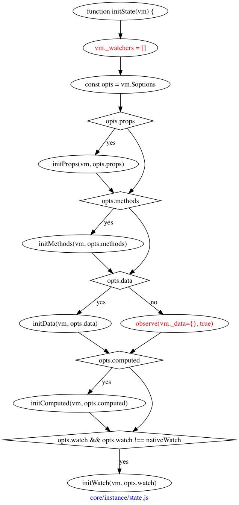

# vue 源码阅读过程

## 起点

```javascript
new Vue({
	el: '#app',
	template: '<App />',
	components: { App },
});
```

从这里开始，发生了什么？


## _init

在`_init`方法中，主要就是给`vm`添加了一些属性

- vm._uid = uid++
- vm._isVue = true
- vm._renderProxy = vm
- vm.$options = options
- vm._self = vm


可以看到，最后面是进行了一系列的初始化函数调用，并且调用了两个生命周期钩子，`beforeCreate`和`created`，这又代表什么含义呢？

### initLifecycle

从名字看是初始化生命周期，实际上也是给`vm`实例添加了很多属性。

- vm.$parent = options.parent
- vm.$root = $parent.root || vm
- vm.$children = []
- vm.$refs = {}
- vm._watcher = null
- vm._inactive = null
- vm._directInactive = false
- vm._isMounted = false = false
- vm._isDestroyed = false
- vm._isBeingDestroyed = false

总的来说，就是`$parent`比较麻烦些，大部分情况应该都是`undefined`吧，不然`vm.$options.parent`是什么时候挂载的？

有点出乎意料的是，在这个函数入口打断点，看到的`vm.$options`不只初始化时传入的属性，还有一些框架添加的，但是在什么时候添加的不清楚。[1]


### initEvent

从名字就看得出来，在这个函数内会对事件进行初始化，但是，是对什么事件进行初始化？

可以看到是从`$options._parentListeners`上取到所谓的`listeners`，如果存在，就更新到组件上。

但是默认情况是没有的，要怎么添加，才可以在这里得到呢？[2]


### initRender

然后到了这里，从名字来看是初始化`render`？

- vm._vnode = null
- vm.$solts = resolveSlots()
- vm.$scopedSlots = emptyObject
- vm._c = func
- vm.$createElement = func
- vm.$attrs
- vm.$listeners


在最后，调用`defineReactive`方法，这个方法接收`obj`、`key`和`val`，即一个对象及指定键值对，然后对值注册监听器。


那是对我们传入的`data`做监听，实现数据响应吗，不是，从`initRender`这张图片最后可以看到，是对`$attrs`和`$listeners`这两个`vm`上的属性做了这个处理。

所以这里就要深究`Dep`到底是什么，怎么工作的[3]

### Dep

注释是：
> A dep is an observable that can have multiple directives subscribing to it.


每个`Dep`实例有`subs`属性，保存了多个`Watcher`实例，在调用`dep.notify`方法时，会遍历该数组，对每个`Watcher`实例调用`update`方法。


### initInjections

[provide/inject](https://cn.vuejs.org/v2/api/#provide-inject)

> provide 和 inject 主要为高阶插件/组件库提供用例。并不推荐直接用于应用程序代码中。


### initState

终于到了我们最熟悉的地方，在`initState`函数内，会对`props`、`methods`、`data`、`computed`以及`watch`进行处理，对，就是我们在日常中最常用到的这些，都在`initState`函数内进行处理。



可以看到，先判断属性是否存在，然后依次调用

- initProps
- initMethods
- initData
- initComputed
- initWatch

下面再对每一个函数深入了解

#### initProps

遍历传入的`props`，首先是进行验证，然后调用`defineReactive`对每个`key`做处理。

- vm._props = {}
- vm.$options._propKeys = []


#### initMethods
很简单的一个函数，其实就是遍历`methods`执行一句代码：

```javascript
vm[key] = methods[key] == null ? noop : bind(methods[key], vm)
```

这里是用的`==`而非`===`，只有在值为真时，才调用`bind`方法，这个方法就是`Function.prototype.bind`的那个，绑定上下文。


#### initData

其实在`initData`内并没有做什么，主要还是一些重复属性的错误提示，最主要的工作还是由`observe`来做的，后面再对这个进行分析。


#### initComputed

首先是初始化了`_computedWatchers`这个属性，从名字来看是保存计算属性的监听器。然后这里存在`isSSR`这个变量用以判断是否为服务端渲染。

然后会实例化多个`watcher`

```javascript
const computedWatcherOptions = { lazy: true };
watchers[key] = new Watcher(
	vm,
	getter || noop,
	noop,
	computedWatcherOptions
)
```


然后对每个`key`调用`defineComputed`函数，其实就是给`sharedPropertyDefinition`设置`get`和`set`属性，最后调用`Object.defineProperty()`。

```javascript
const sharedPropertyDefinition = {
  enumerable: true,
  configurable: true,
  get: noop,
  set: noop
}
```


#### initWatch


遍历`watch`并给每个键调用`createWatcher`，


而在`createWatcher`中其实就是调用了`vm.$watch`，

而在`vm.$watch`中，其实最终还是实例化`Watcher`。

### initProvide

只是添加了`vm._provide`这一个属性，和上面的`inject`配合使用。


调用该方法后，就完成了`create`，这么看来似乎是`vm`的创建。

## $mount
OK，终于完成了初始化，到目前为止都是平台无关的，接下来就和运行的平台有关了，所以是分为了`web`与`weex`两个不同的`$mount`实现，当然这里只会分析`web`端的实现，这部分的入口在`vue/platforms/web/entry-runtime-with-compiler.js`。

在这之前，先看看最终得到的`vm`是什么样，额，由于存在自引用导致无法打印，所以就打印可遍历的属性看看吧：

```json
[
  "_uid",
  "_isVue",
  "$options",
  "_renderProxy",
  "_self",
  "$parent",
  "$root",
  "$children",
  "$refs",
  "_watcher",
  "_inactive",
  "_directInactive",
  "_isMounted",
  "_isDestroyed",
  "_isBeingDestroyed",
  "_events",
  "_hasHookEvent",
  "_vnode",
  "$vnode",
  "$slots",
  "$scopedSlots",
  "_c",
  "$createElement",
  "$attrs",
  "$listeners",
  "_watchers",
  "_data",
  "age",
  "name",
  "_computedWatchers",
  "message"
]
```
大部分还是有印象的。

好，开始`mount`吧。
在这个函数内，主要是对`el`、`template`做处理，需要将这两个转换为`render`函数，如果已经有`render`函数，会忽略`template`。


如果使用`template`，就会存在编译的过程，我们无需关心编译，只关心编译后的结果，很明显编译后的和我们自己声明的`render`函数应该是一样的格式。

### mountComponent

有趣的是，是先在`runtime/index.js`里面声明了`$mount`方法，然后又在`entry-runtime-with-compiler.js`保存了一下，然后覆盖。

这就导致了，完成编译后，会调用`runtime/index.js`的`mount`方法，其实就是调用`mountComponent`方法。

就不画流程图直接上代码了：

```javascript
Vue.prototype.$mount = function (
  el?: string | Element,
  hydrating?: boolean
): Component {
  el = el && inBrowser ? query(el) : undefined
  return mountComponent(this, el, hydrating)
}
```

那在`mountComponent`内又做了什么呢？

- vm.$el = el
- vm._watcher = new Watcher()
- vm._isMounted = true

从调用的生命周期钩子来看，就是完成了节点的渲染并插入页面，但是好像并没有调用什么`render`之类的函数呀？唯一调用的就是`new Watcher()`。


### Watcher

`Watcher`是`Vue`最核心的一个类，控制着数据是否要更新，以及如何更新。

可以看到，`watcher`实例上也有非常多的属性，最重要的是`dirty`这个，当`dirty === true`，表示要重新获取值。实例化的过程就是一些赋值，重点在最后的一句：

```javascript
this.value = this.lazy ? undefined : this.get()
```

即如果配置了该`watcher`是`lazy`，即延迟获取数据，在实例化的时候就不会去获取值，暂时看到`computed`对应的`watcher`是设置了`lazy === true`的。

至少在上面`mountComponent`时是要去获取值的，OK，那具体怎么获取值呢？

#### Watcher.prototype.get


### vm._render

来到了`core/instance/render.js`这个文件。

最核心的就是调用`render`方法，得到`vnode`，其他的就是添加了一些属性。

- vm.$vnode = _parentVnode

`render`函数是由模板解析得到的，我们直接查看下`vnode`到底是什么

```javascript
vnode = VNode {
    elm: undefined,
    functionalContext: undefined,
    functionalOptions: undefined,
    functionalScopeId: undefined,
    isAsyncPlaceholder: false,
    isCloned: false,
    isComment: false,
    isOnce: false,
    isRootInsert: true,
    isStatic: false,
    key: undefined,
    ns: undefined,
    parent: undefined,
    raw: false,
    tag: "vue-component-1-app",
    text: undefined,
    child: undefined,
    asyncFactory: undefined,
    asyncMeta: undefined,
    children: undefined,
    componentInstance: undefined,
    data: {
        hook: {
            destroy: ƒ destroy(vnode),
            init: ƒ init(vnode, hydrating, parentElm, refElm),
            insert: ƒ insert(vnode),
            prepatch: ƒ prepatch(oldVnode, vnode),
        },
        on: undefined,
    },
    context: VueInstance,
    componentOptions: {
        Ctor: ƒ VueComponent(options),
        children: undefined,
        listeners: undefined,
        propsData: undefined,
        tag: "App",
    },
}
```

重点是`componentOptions`和`data`。


### vm._update

顾名思义，更新实例。

如果是初始化就在调用`patch`时传入不同的参数。如果是更新，就只传入`prevVnode`和`vnode`，如果父节点是`HOC`？就更新父节点的内容`（vm.$parent.$el = vm.$el）`。


还没有结束，重点在`patch`函数，该函数内会调用`createElm`，该函数又会调用`createComponent`，然后在函数内会取`vnode.data.hook.init`，然后调用这个`init`函数。


所以接下来要断点到`init`函数内看看了。

#### vnode.data.hook.init

位于`/core/vdom/create-component.js`文件内。

`init`钩子会调用`prepatch`钩子，而该钩子又调用`updateChildComponent`函数。


#### updateChildComponent

最后调用了`$forceUpdate`，而该方法只是调用了`vm._watcher.update()`方法。


 
