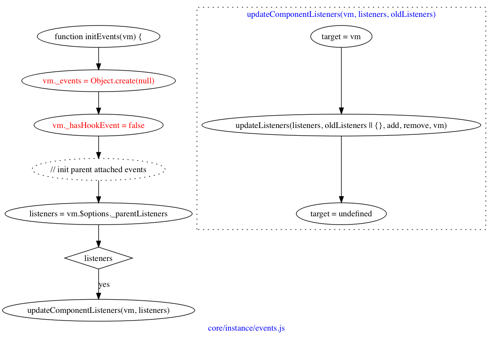

## 初始化事件




代码并不是很多，因为只是遍历，并对每个`listeners`调用了`updateComponentListeners`函数，这最终有什么效果呢？


（待验证）假设我们的组件是这样的：

```
new Vue({
    render(c) {
        c('div', {
            on: {
                click($event) {
                    console.log('click');  
                },
            },
        }, ['click']);
    }
});
```

当点击`div`时，就会打印`click`，就是通过这里的`updateComponentListeners`，给`div`注册了点击事件。


