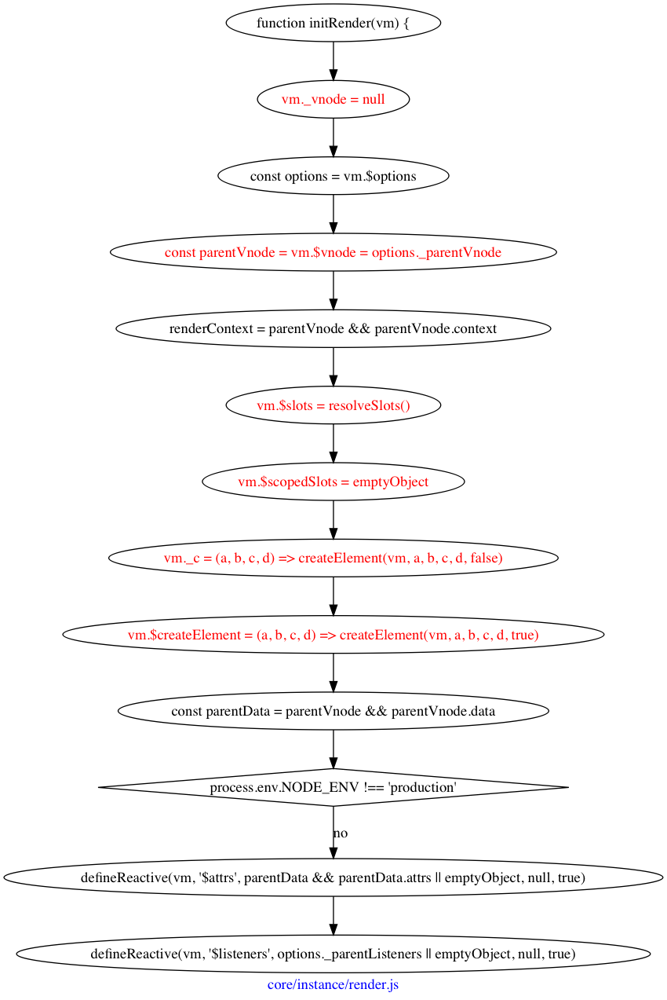

## 初始化渲染方法

所谓的“渲染”到底是指什么？

这里给`vm`实例添加了`_c`和`$createElement`方法，区别只在于最后面的参数为`true`或者`false`。

最后，调用了`defineReactive`方法，给`vm`添加了`$attrs`和`listeners`属性并且这两个属性是“响应式”。

虽然我告诉你，这两端代码在大部分情况下是无意义的，不过可能你非常想了解`defineReactive`的具体内容，可以直接跳转到。

OK，如果你看了上面的文章，那你就会知道，`$attrs`和`$listeners`成为了“响应式系统”。当我在代码中，使用`this.$attrs`，就会调用对应的`getter`，得到在这里传入的第三个参数，`emptyObject`，`$listeners`一样。

