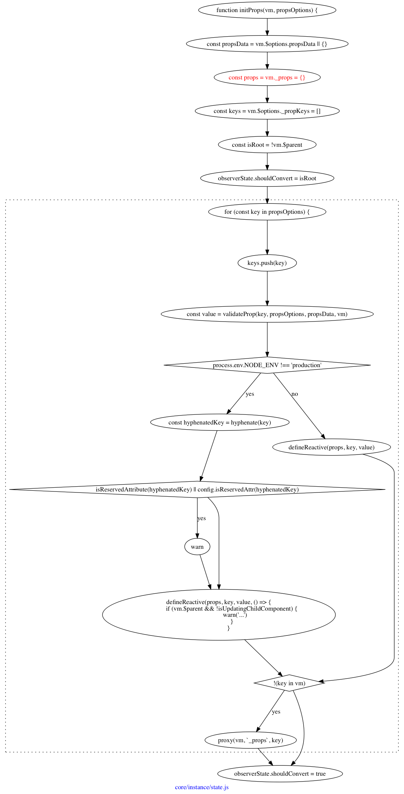

## 初始化属性



看起来很复杂，最主要的就是一件事，将`props`上的属性变成响应式属性。即假设你有这样的属性：

```javascript
new Vue({
    props: ['hello'],
});
```

最后就得到了

```javascript
vm._props = {
    0: 'hello',
};
```

并且在最后，代理了`key`，所以`vm[0] === vm._props[0]`。

> 当然还有一些琐碎的事情，比如将`key`存放到`$options.propKeys`中；对`key`进行验证是否已经存在同名的`data`。

