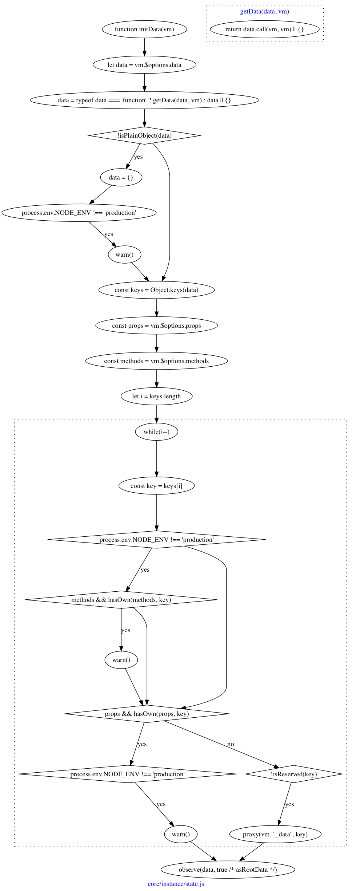

## 初始化数据

其实这里成为“初始化状态”更为合适些吧，因为`data`在`Vue`中，就和`state`在`React`中差不多，都是保存了实例的状态，并且当该状态发生变化，就会重新渲染视图。

看起来也很多代码，但大致的逻辑和之前一样，判断是否有同名的`props`、`methods`，如果有就在控制台打印错误。

重点在最后，`observe(data, true)`，这`observe`是何方神圣？

有意思的是，`observe`其实是有返回值的，返回创建的`Observer`实例，但是这里并没有接收该实例。只是利用了`new Observer`过程中会给`data`添加`__ob`属性，该属性内保存了很多东西。

