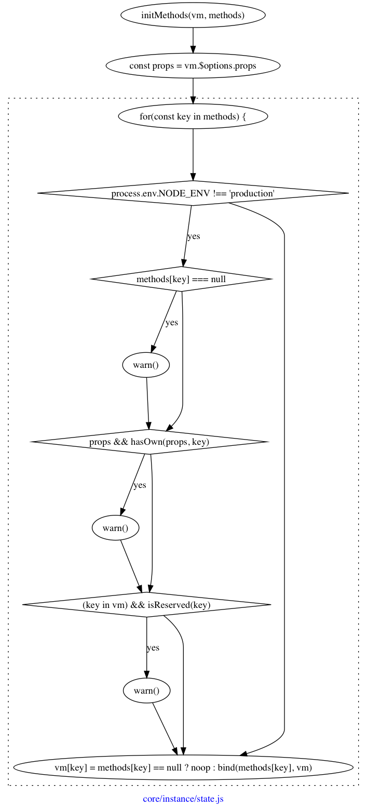

## 初始化方法



这应该算最简单的处理函数了，只是简单的做一下验证，是否有同名的`props`，然后给方法绑定`this`指向，最后同时给`vm`实例上也添加同名的方法便于调用。

所以

```javascript
const vm = new Vue({
    methods: {
        say() {
            console.log('hello vue');
        },
    },
});

vm.say(); // hello vue
```

上面的代码是完全 OK 的。


