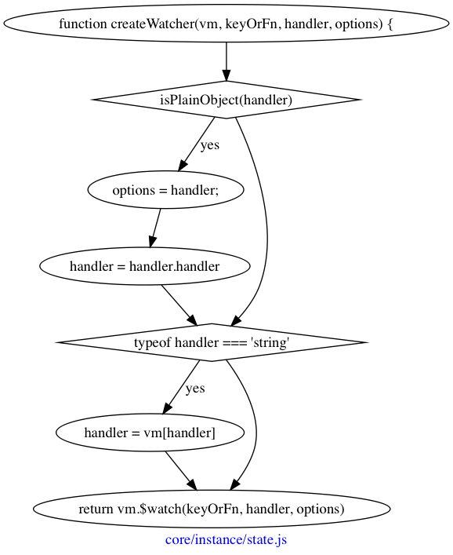

## 初始化监听

讲道理很少会需要用到`watch`属性，顾名思义，它可以监听一个值，当值发生改变的时候，就调用定义好的方法。

比如：

```javascript
new Vue({
    data() {
        return {
            name: 'ltaoo',
        };
    },
    watch: {
        name: function log() {
            console.log('name is change');
        },
    },
});
```

可以实现当`this.name`发生变化，就打印`name is change`。为什么可以实现呢？

答案是通过`Watcher`，这里就可以详细介绍下这个很重要的存在了。





核心就是最后面这里的`const watcher = new Watcher(vm, expOrFn, options)`了，

~~其实就是`log`函数的调用依赖于`name`这个值。而我们之前已经知道`name`被调用了`defineReactive`，当发生改变时，会调用`dep.notify()`方法，这个方法会遍历`subs`，对每一个元素调用`update`方法。~~

~~而`update`最终还是会去调用`get`，而`get`，就是`log`函数。~~

~~那是什么时候，将得到的`watcher`放入`name`闭包中的`dep.subs`中的呢？~~

`expOrFn`是`name`，而`cb`就是`log`函数，在`name`值发生变化，最后调用每一个`watcher.run`时，就调用了`log`函数。


在`initWatch`时，就会对`name`调用`new Watcher`，得到的`getter`是：

```
return function (obj) {
    for (let i = 0; i < segments.length; i++) {
        if (!obj) return
        obj = obj[segments[i]]
    }
    return obj
}
```

而每一个`watcher`都会被保存到`vm._watchers`中。


在`Watcher`中，会获取到`name`对应的值，

重点是

```
this.getter = parsePath(expOrFn)
```
得到的`getter`是
```
return function (obj) {
    for (let i = 0; i < segments.length; i++) {
        if (!obj) return
        obj = obj[segments[i]]
    }
    return obj
}
```

而这里返回的`obj`，是`name`对应的值！

最重要的就是`watcher.get`方法了，在该方法的开始，就将`this === Dep.target`，然后就调用`this.getter`，一旦在调用该方法的过程中，有去获取`data`，那对应的键，这里就是`name`，会将`watcher`保存到自己闭包中`dep.subs`中。


可以说`watch`方法得到的`watcher`，就是通过这种方式保存了起来。

