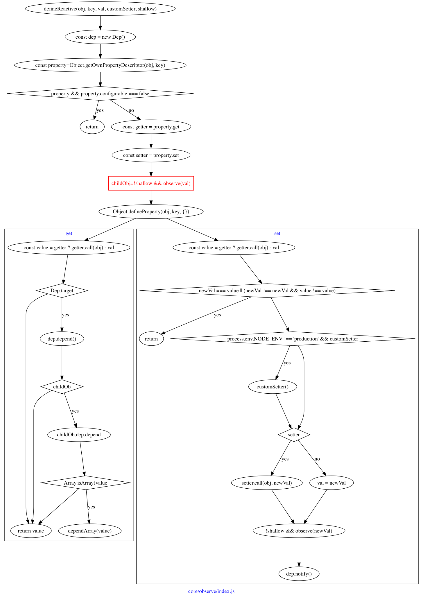

## 创建响应式属性

`Vue`区别于`React`的一大特点就是基于响应式系统，这也是`Vue 1.x`的基础。

对，如果你之前有`Vue`源码分析相关的文章，这部分内容是作为重点来介绍的，`setter`和`getter`，基于这两个属性，实现了响应式系统。

> 其实这个时候我应该要介绍下原理，但我更推荐搜索相关的文章，什么是`getter`和`setter`，他们有什么用。当然我后面会补上。

这里就是给指定属性设置`getter`和`setter`，除此之外，还有一个`dep`存在于`getter`和`setter`的闭包中。

> 什么是闭包呢？就是无论在什么地方调用这里的`getter`或者`setter`方法，都能够获取到`dep`这个变量。

先给“响应式系统”下一个明确的定义，便于讨论。在这篇文字中，将一个设置了`setter`和`getter`的属性，称之为“响应式系统”。

`Dep`严格来说不属于“响应式系统”的一部分，它是负责维护各个响应式系统之间的依赖关系。

