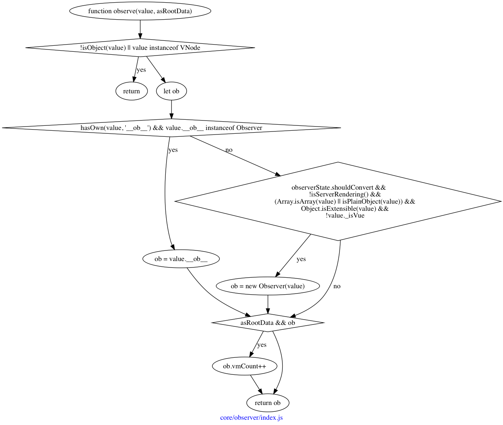

## 创建观察者



函数名是“观察”，表示观察传入的`value`，怎么观察呢？通过实例化`Observer`。

等等，为什么又出来了个`Observer`？

`Vue`的响应式机制，靠`Observer`、`Watcher`和`Dep`三者共同实现。

> Observer 的翻译是观察者，Watcher 是守望者，这两个有什么区别吗？

这里应该要用东西来打个比方了。

假设如下代码：

```javascript
const vm = new Vue({
    data() {
        return {
            year: 2017,
            person: {
                name: 'ltaoo',
                age: this.year - 1993,
            },
        };
    },
    methods: {
        getNextAge() {
            setTimeout(() => {
                console.log(this.person.age);
            }, 365 * 86400000);
        },
    },
});
```

在声明周期走到`initData`的时候，将

```javascript
{
    year: 2017,
    person: {
        name: 'ltaoo',
        age: this.year - 1993,
    },
};
```

作为参数传入`observe`函数，该函数判断需要实例化`Observer`，于是调用`new Observer`，而实例化的过程，就是遍历该对象，调用`defineReactive`，最终得到这样的结果：

```javascript
{
    year: 2017,
    person: {
        name: 'ltaoo',
        age: this.year - 1993,
        __ob__: {
            value: {self},
            dep: Dep,
            vmCount: 0,
        },
    },
    __ob__: {
        value: {self},
        dep: Dep,
        vmCount: 0,
    },
};
```

每个对象都会被添加上`__ob__`属性，而每一个属性，都会变成“响应式属性”，

事实上，在给`person`调用`defineReactive`方法时，就会给`person`的值调用`observe`了，导致并不是使用`walk`对`data`递归，而是使用`defineReactive + observe`实现了深层遍历。

OK，假设理解了这一段，它有什么作用？

我是谁？我在哪？我要做什么？


